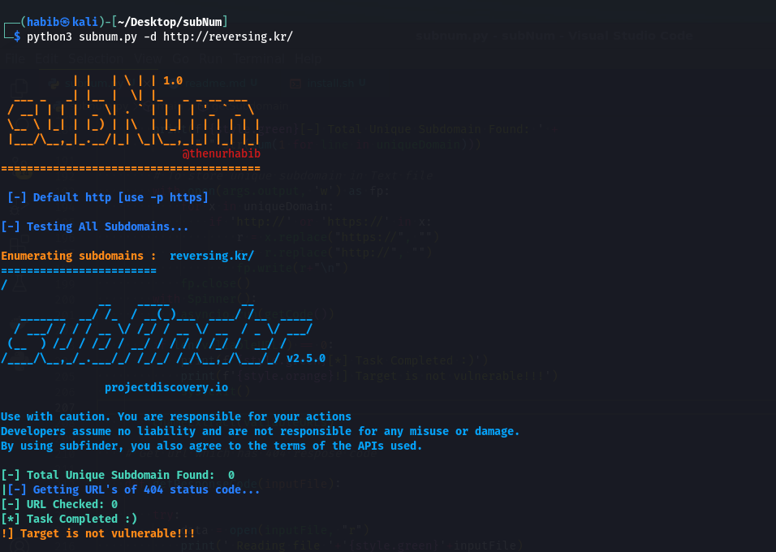
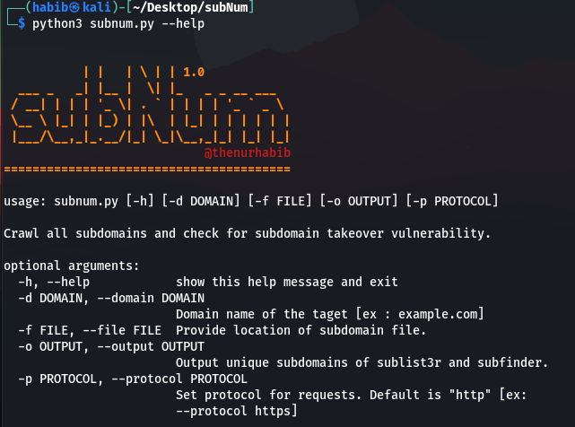

<h1 align="center">
  <br>
  <a  href="https://github.com/thenurhabib/subnum"></a>
  <br>
  subNum
  <br>
</h1>

<h4 align="center">Crawl all URLs and check for subdomain takeover vulnerability.</h4>

<p align="center">
  <a href="https://github.com/thenurhabib/subnum/releases">
    
  </a>
  <a href="https://travis-ci.com/thenurhabib/subnum">
    
  </a>
  <a href="https://github.com/thenurhabib/subnum/issues?q=is%3Aissue+is%3Aclosed">
      
  </a>
</p>



<hr>

### subNum Crawl all URLs and check for subdomain takeover vulnerability.

<br>

### Main Features
- Find All Subdomains.
- Automatically crawl all URLs.
- Automatically test all subdomains for subdomain .takeover vulnerability.
- very first all everything automated.
- Advanced error handling.
- Multiprocessing support.

<br>



<br>


### Documentation
### install
```yaml
git clone https://github.com/thenurhabib/subnum.git
cd subnum
chmod +x install.sh
sudo bash ./install.sh

```


#### Usage

```python3 subnum.py --help```

```yaml

┌──(habib㉿kali)-[~/Desktop/subNum]
└─$ python3 subnum.py --help


           | |   | \ | | 1.0              
  ___ _   _| |__ |  \| |_   _ _ __ ___  
 / __| | | | '_ \| . ` | | | | '_ ` _ \ 
 \__ \ |_| | |_) | |\  | |_| | | | | | |
 |___/\__,_|_.__/|_| \_|\__,_|_| |_| |_|
                            @thenurhabib 
========================================
          
usage: subnum.py [-h] [-d DOMAIN] [-f FILE] [-o OUTPUT] [-p PROTOCOL]

Crawl all subdomains and check for subdomain takeover vulnerability.

optional arguments:
  -h, --help            show this help message and exit
  -d DOMAIN, --domain DOMAIN
                        Domain name of the taget [ex : example.com]
  -f FILE, --file FILE  Provide location of subdomain file.
  -o OUTPUT, --output OUTPUT
                        Output unique subdomains of sublist3r and subfinder.
  -p PROTOCOL, --protocol PROTOCOL
                        Set protocol for requests. Default is "http" [ex:
                        --protocol https]


```

<br>


### Author
```yaml
Name       : Md. Nur habib
Medium     : thenurhabib.medium.com
Twitter    : https://twitter.com/thenurhab1b
HackerRank : https://www.hackerrank.com/thenurhabib

```


##### Thank You.
